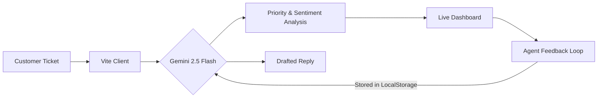

# SupportAI Analyst 🚀

[](https://support-ai-analyst.vercel.app/)
[](https://aistudio.google.com/)
[](https://opensource.org/licenses/MIT)
DEMO LINK:
https://drive.google.com/file/d/1YfqBmm4wOG80g1w7qrVSqnlTWHQGTKzs/view?usp=vids_web

> **An intelligent, real-time customer support triage dashboard that automates prioritization and sentiment analysis using Gemini 2.5 Flash.**


---

## 💡 The Problem
Customer support teams are drowning in a sea of generic tickets. Manual triage is slow, leading to:
- **Critical issues** (billing errors, high-churn signals) sitting unread for hours.
- **Agent burnout** due to repetitive sorting tasks.
- **Customer frustration** from slow response times.

## 🎯 The Solution
**SupportAI Analyst** is a high-performance "first-responder" dashboard. It leverages Google's **Gemini 2.5 Flash** to:
1.  **Instant Triage**: Categorize and prioritize tickets the millisecond they arrive.
2.  **Explainable AI**: Not just a "High" tag—it explains *why* the ticket was prioritized.
3.  **Human-in-the-Loop**: Learn from agent corrections in real-time using a local feedback loop.
4.  **Auto-Drafting**: Generate empathetic responses instantly for agent review.

---

## ✨ Key "Wow" Features

### 🧠 1. Explainable Reasoning
Every ticket analyzed by Gemini includes a detailed "AI Detailed Insight" section. It breaks down the logic, such as identified keywords and business impact risks.

### 🔄 2. Real-Time Feedback Loop (RLHF)
If an agent corrections an AI-assigned priority, the system **remembers** that correction. This feedback is dynamically injected into future prompts, allowing the AI to "learn" business-specific policies without retraining.

### ⚡ 3. Gemini 2.5 Flash Native Integration
By leveraging the Flash model, we achieve sub-2-second analysis speeds while maintaining high-quality reasoning, making real-time triage truly viable at scale.

### 💅 4. Premium Glassmorphic UI
A sleek, modern interface with 60fps animations, glowing status indicators, and a dark-mode-first aesthetic that screams "Enterprise Grade."

---

## 🏗️ Architecture



---

## 🛠️ Tech Stack

- **Frontend**: React 18, Vite (for lightning-fast HMR)
- **AI Engine**: Google Generative AI SDK (Gemini 2.5 Flash)
- **Styling**: Modern Vanilla CSS (Glassmorphism, CSS Variables)
- **Icons**: Lucide React
- **Deployment**: Optimized for Vercel

---

## 🚀 Quick Start

### 1. Prerequisites
- Node.js (v18 or higher)
- A **FREE TIER** Google AI Studio API Key ([Get one here for free](https://aistudio.google.com/app/apikey))
  - *Note: Ensure you use "Google AI Studio" rather than "Vertex AI" to avoid 404/permission issues.*

### 2. Installation
```bash
git clone https://github.com/Mukul7Raj/SupportAI-analyst.git
cd SupportAI-analyst
npm install
```

### 3. Setup Environment Variables
Create a `.env` file in the root directory:
```env
VITE_GEMINI_API_KEY=your_gemini_api_key_here
```

### 4. Run Locally
```bash
npm run dev
```

---

## 👥 Meet the Team
Built with ❤️ during the **SupportAI Hackathon 2024**.

---

## 📜 License
This project is licensed under the MIT License - see the [LICENSE](LICENSE) file for details.
